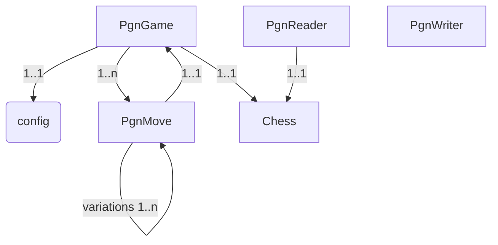

# TODOs

## Examples

* Find in [Best chess games of all times](http://www.chessgames.com/perl/chesscollection?cid=1001601) some examples. Heavily annotated, but variations in the comments (only). Have to been reworked to be playable.
* [Annotated old games](http://www.chessgames.com/perl/chesscollection?cid=1013362) like the previous ones.
* [Nice annotated current games](https://gameknot.com/best-annotated-games.pl) but mostly also with variations in comments.
* [Chessgames.com annotated](http://www.chessgames.com/perl/ezsearch.pl?search=annotated) archive, have to check that as well.
* Save some of them under `examples/pgn` and try to make them richer.

Interestingly, heavily annotated games are the exception, not the rule, and a lot of them are done wrong.

## Structure

Current structure is the following:

* `src/*.ts|*.d.ts`: Typescript source files or source declaration files.
* `src/pgn-rules.peg`: Grammar for pgn --> will be compiled to `lib/js/pgn-parser.js` by task `peg`.
* `src/tests/*-spec.ts`: Jasmine scipts to test the application.
* `spec/support/jasmine.json`: Specification of the jasmine tests at the standard location.
* `node_modules`: As usual, not in CM, managed by npm.
* `lib`: Base directory for the targets:
  * `lib/css`: Manually managed CSS and other files.
  * `lib/img`: Common image files used in the UI.
  * `lib/js`: Generated Javascript files (from Typescript or from the PEG grammar). Also currently the needed libraries `json3`, `jquery` and `chessboard`. Will be replaced by versions from NPM later.
* `dist`: minified versions of the whole application. This should (later) be the base for all examples. So the HTML files to show the functionality should be minimal from the boilerplate code needed. Not implemented yet.
* `.gitignore`: Don't have to explain that.
* `.travis.yml`: Needed on the (working) build process on travis-ci. See [Travis CI build for PgnViewerTS](https://travis-ci.org/mliebelt/PgnViewerTS).
* `package.json`: The usual file, defines all dependencies and the tasks that are used during development.
* `tsconfig.json`: Settings for the TypeScript compiler.
* `typings.json`: Do I need to fill that file?

## Steps to implement

* Started with the PEG parser (existing), and built the specs to test it all. ==> Allows to read PGN files in raw format, throws syntax error if something is wrong. See `parse-spec.ts` for details.
* Then algorithm to generate real moves (with new defined PgnMove), so that there is a real API connected to it. This algorithm is now complete (including variations), but has to be tested more thoroughly. See `move-spec.ts` for details.
* Then the validation of the moves. Currently, only the syntax is checked, and a lot of flags (like STRIKE, CHECK, DISCRIMINATOR) is not checked at all, but just taken from the moves. The information about the move number is kept, but should be recomputed. See `validate-spec.ts` for details. `game-spec.ts` is currently very similar, but should handle game (things in the future (like checking the seven rooster tags, ...)).
* The writing of the moves (as standard PGN notation) is checked outside, and has to be very strict compared to the reading of the PGN games (like the specification tells us). See `writer-spec.ts` for details what is checked.

## Algorithm for Validation

* Iterate over the moves. :white_check_mark:
* For each move, get the start FEN first. This should be held in each move. :white_check_mark:
* For the start move, the FEN is set from the startPosition of the PGN instance. :white_check_mark:
* Try to make the move from that position, make the move through Chess. :white_check_mark:
* In error, try variations: disambiguation (too much), start and stop position, ... :x:
* Using an array of moves seems to be the wrong approach. Normally, it should be sufficient to have the first move, this is used for the variations, and it works well there. :x:

### Validation in chess.js

The following things are not allowed at the moment in chess.js

* Wrong disambiguation:
  * Q8d5 with only one queen (or only one queen is able to move to d5) ==> Qd5
  * N8c6 ==> Nc6 needed
* Left out column character for pawn moves
  * exd5 needed, xd5 is not allowed (even if only one pawn can capture on d5)
* Get in touch with `chess.js` and enter there tickets, so that those facts are known. At least the last one hurts, because you have to "invent" disambiguation even if it is not needed. See [fork of chess.js](https://github.com/mliebelt/chess.js) what I proposed to change. I use in my code this variation of `chess.js`. :white_check_mark:

## Development and Build

### :white_check_mark: Build with NPM

Done it for part of the build process, and man, it does not hurt! It was pretty easy to get rid of some of the dependencies, so I will use in the future `package.json` only for that purpose.

### :white_check_mark: Unit Testing

I am using Jasmine for unit tests, but would like to write those tests in Typescript (only)

* Found [Installable typings files](https://angular.io/docs/ts/latest/guide/typescript-configuration.html) that had the following line: `npm install @types/jasmine --save-dev`
* Use `package.json` to define the task "jasmine", and use `jasmine.json` to define the default parameters and structure.
* Run jasmine then in the command shell by calling `npm test` for all tests or `npm test lib/js/tests/GameSpec.js` to run only the GameSpec tests.
* You have of course to recompile changed TypeScript files all the time before the test, but this can be automated as well.

### :x: UI Testing

I would like to use Jasmine (because I know it pretty well), and Karma and PhantomJS to do UI tests. But I first have to implement some UI to start that task ...

This is what I have installed (directly):

* `karma`: The UI test framework (unclear, what it does)
* `karma-jasmine`: Integrate Jasmine into Karmo (or the other way round?)
* `karma-phatomjs-launcher`: Allows to run UI tests in the non-UI browser PhantomJS
* `grunt-karma`: to use Grunt for the tasks

### :white_check_mark: Integrate Emojis into Markdown

* [Stackoverflow Question](https://stackoverflow.com/questions/43020963/how-to-integrate-markdown-it-emoji-into-vs-code) about my problem with the integration.
* [VS Code Extension to Markdown and Emoji](https://github.com/mjbvz/vscode-markdown-emoji) Great extension that did the job at the end. Not official released, but works at the moment.

The extension is now in the marketplace, and you should be able to install it directly from there. Name is `markdown-emoji`. And it works then as well on Github, see for example [this todo.md file there](https://github.com/mliebelt/PgnViewerTS/blob/master/todo.md).

## Rough Design

The rough design (in textual mode) is the following:

### Classes

* PgnGame: one game extracted from a PGN string.
* PgnList: is that necessary? Perhaps just an array of PgnGame is sufficient.
* PgnReader: Reads a string of one or more PgnGame(s) and returns just that.
* PgnWriter: Takes one or more PgnGame(s) and writes our the games as specified. See the [specification](http://www.saremba.de/chessgml/standards/pgn/pgn-complete.htm) for details.
* PgnMove: chess moves in the PgnGame.
* Chess: Registered as (typed) class, from the external library.
* ChessBoard: Registered as well, also from the external library

### Relations

The following diagram is done with the help of [Mermaid](https://mermaidjs.github.io) and the corresponding plugins in VS Code: `Mermaid Preview` and `Markdown Preview Mermaid Support`

